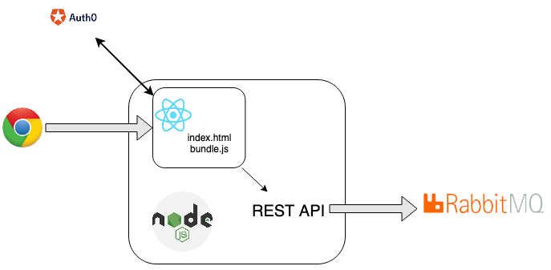

= Web Application template

== 🥞 Technical stack

Language:: Typescript 👉 https://www.typescriptlang.org
Server:: 
* NodeJS 👉 https://nodejs.org/en/ 
* Express 👉 https://expressjs.com/fr/

Client:: React 👉 https://fr.reactjs.org/

.Gateway Architecture

== 🛠 How to build

Pre-requisite:: Install Node `14` 

[TIP]
====
Use `nvm` to install and manage your node installations :

* Mac/Linux 👉 https://github.com/nvm-sh/nvm
* Windows 👉 https://github.com/coreybutler/nvm-windows
====

=== Server

[source]
----
npm install
npm run build
----

=== Client

[source]
----
npm install
npm run build
----

=== Docker

Pre-requisite:: Install Docker 🐳

* Windows  👉 https://docs.docker.com/docker-for-windows/
* Mac 👉 https://docs.docker.com/docker-for-mac/
* Linux 👉 https://docs.docker.com/install/linux/docker-ce/ubuntu/

[source]
----
docker build -t cutting-room-application-base .
----

== 🚀 How to start

=== Dev Mode

.Start server 👉 http://localhost:8080/ping
[source]
----
npm start
----

.Start client 👉 http://localhost:3000
[source]
----
npm start
----

=== Docker

[source]
----
docker run --env-file server/.env -p8080:8080 cutting-room-application-base image:2-3-2020-15-15-20-PM.png[] 
----

[NOTE]
`--env-file` option allows to load environment variables from a file

Web application is available 👉 http://localhost:8080

=== How to debug on vscode

. Server side :
- Run `DEBUG Server` from debug configuration (or `DEBUG Server Unix`)

. Client side : 

- Install `Debugger for Chrome` extension
- Start client (`npm start`)
- Run `DEBUG client` from debug configuration